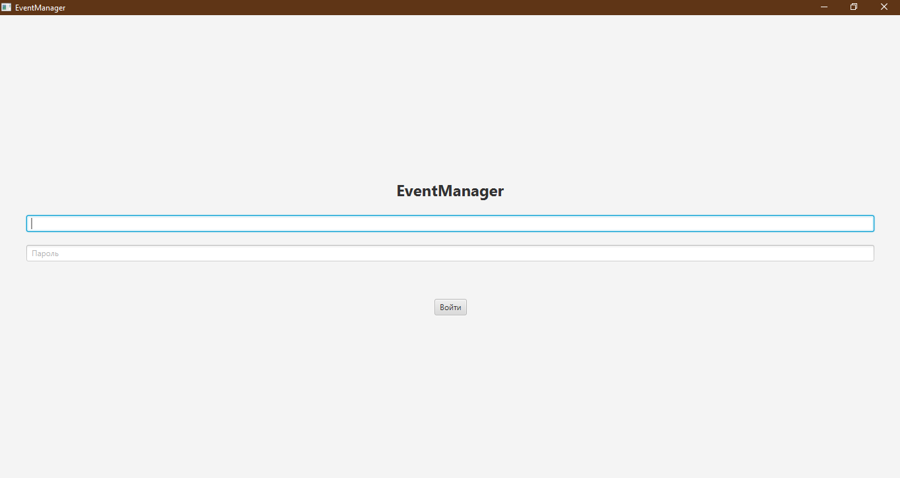
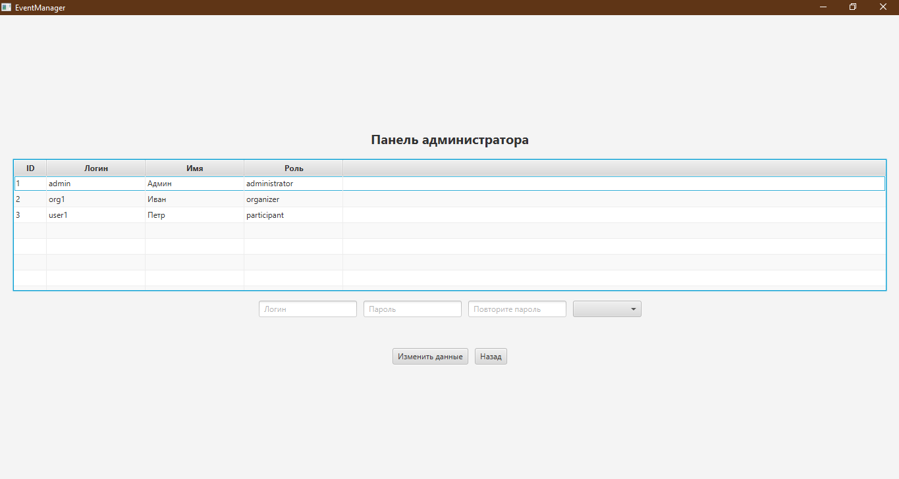
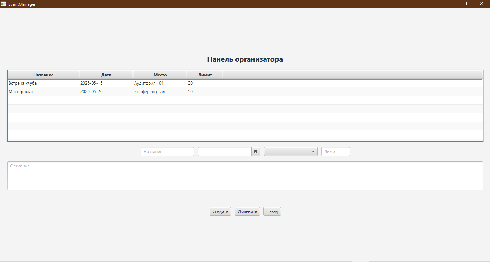
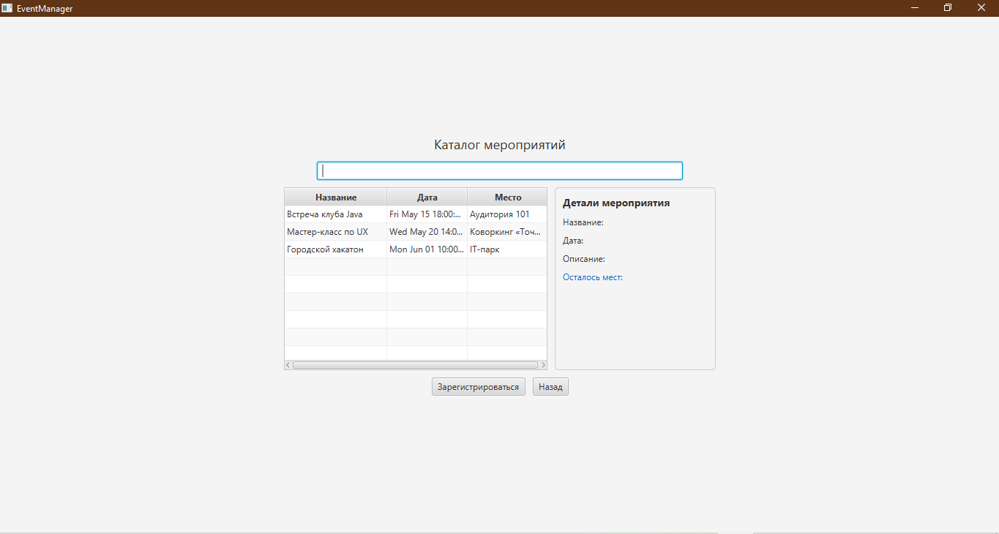

# EventManager

Desktop-приложение для управления локальными мероприятиями.  
Курсовой проект по дисциплине «Конструирование программного обеспечения».

## Описание

Информационная система **EventManager** предназначена для автоматизации процессов планирования, анонсирования и учёта посещаемости локальных некоммерческих мероприятий. Система поддерживает три роли пользователей: **Администратор**, **Организатор** и **Участник**.

## Скриншоты интерфейса

### Окно авторизации


### Панель администратора


### Панель организатора


### Каталог мероприятий (участник)


## Стек технологий

- **Java 11+** — язык программирования
- **JavaFX (FXML, Scene Builder)** — графический интерфейс
- **JPA / Hibernate** — объектно-реляционное отображение
- **MySQL 8.0** — реляционная СУБД
- **Maven** — сборка и управление зависимостями
- **JUnit 5** — модульное тестирование

## Требования

- JDK 11 или новее
- Apache Maven 3.8+
- MySQL Server 8.0+
- JavaFX SDK (если не входит в JDK)

## Установка и запуск

1. Клонировать репозиторий:
   ```bash
   git clone https://github.com/Alw1n-oss/EventManager.git
   cd EventManager
2. Создать базу данных event_manager в MySQL:
   CREATE DATABASE event_manager;
   Затем выполнить скрипт event_manager.sql из корня репозитория.
3. Настроить подключение в src/main/resources/META-INF/persistence.xml (указать логин/пароль от MySQL).
4. Собрать и запустить:
   mvn clean compile
   mvn javafx:run
   
