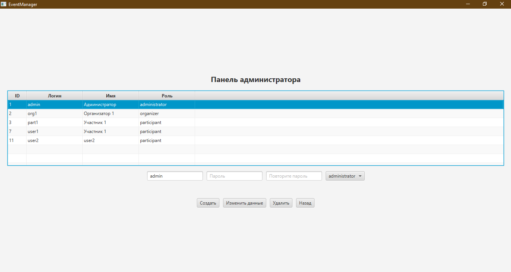
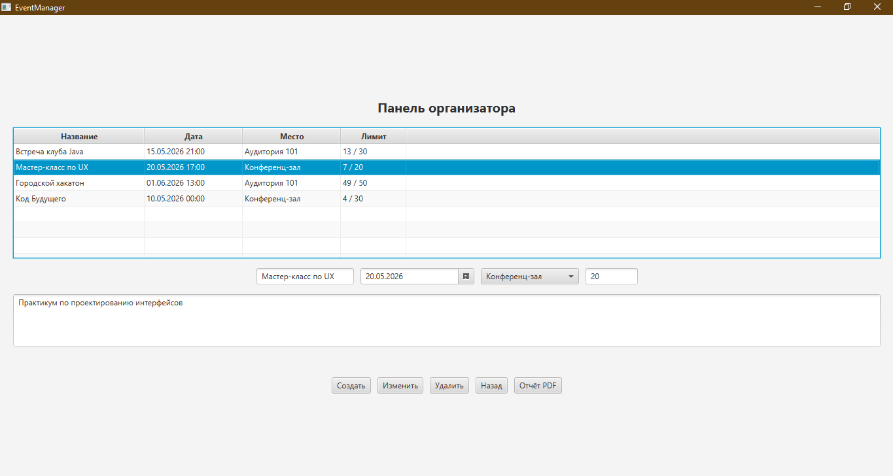
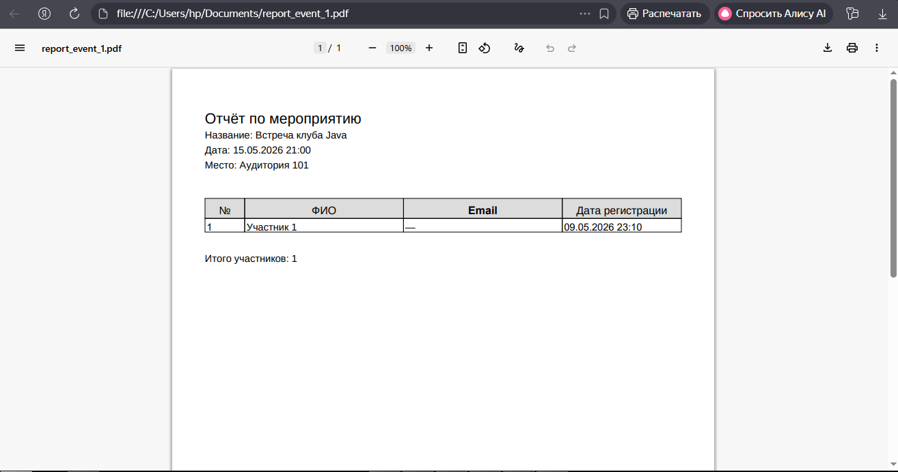
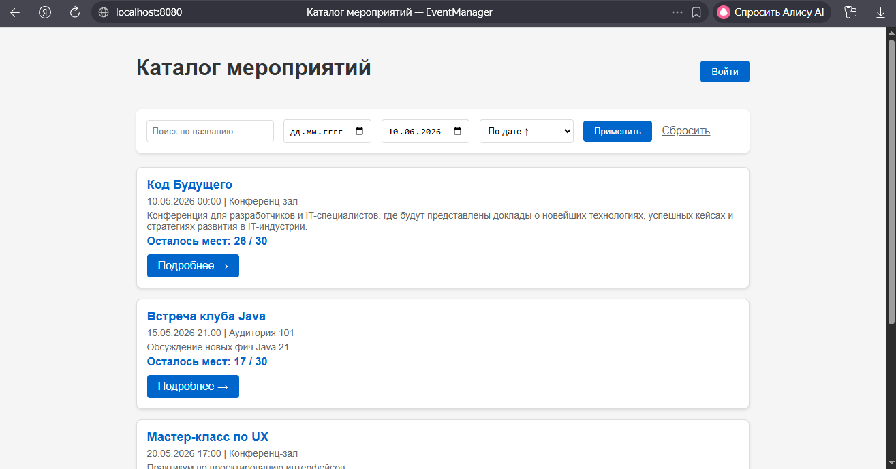
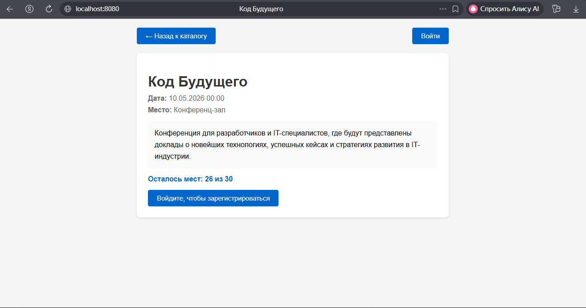
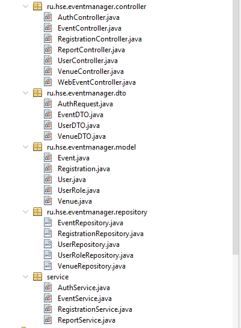

# EventManager

Клиент-серверная информационная система для управления локальными мероприятиями.

## Архитектура
- **eventmanager-api** — сервер на Spring Boot 2.7 (REST API + Thymeleaf веб-интерфейс), порт 8080
- **eventmanager-client** — JavaFX desktop-приложение (HTTP-клиент), порт 8080
- **MySQL 8.0** — база данных, порт 3307

## Стек
- Java 11, Spring Boot, Spring Data JPA, Thymeleaf
- JavaFX (FXML, Scene Builder), HttpClient, Jackson
- OpenPDF, JUnit 5, Mockito, Docker Compose

## Скриншоты

### Панель администратора


### Панель организатора


### PDF-отчёт


### Веб-каталог (Thymeleaf)


### Веб-детали мероприятия


### Структура серверного проекта


## Быстрый старт

### 1. База данных
```sql
CREATE DATABASE event_manager;
-- выполнить event_manager.sql
```
### 2. Сервер
bash
cd eventmanager-api
mvn clean package
java -jar target/eventmanager-api-1.0.jar
Сервер доступен на http://localhost:8080.
### 3. Клиент (JavaFX)
bash
cd eventmanager-client
mvn javafx:run
### 4. Веб-интерфейс (без установки ПО)
Открыть в браузере: http://localhost:8080/web/events
### 5. Docker (опционально)
bash
docker-compose up --build
